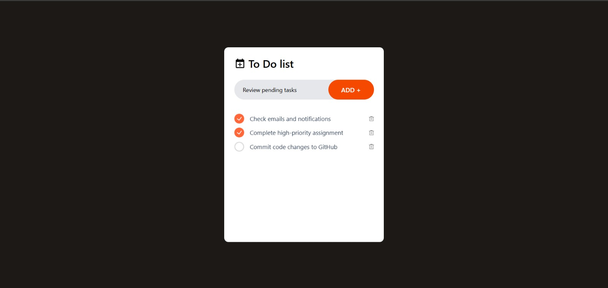
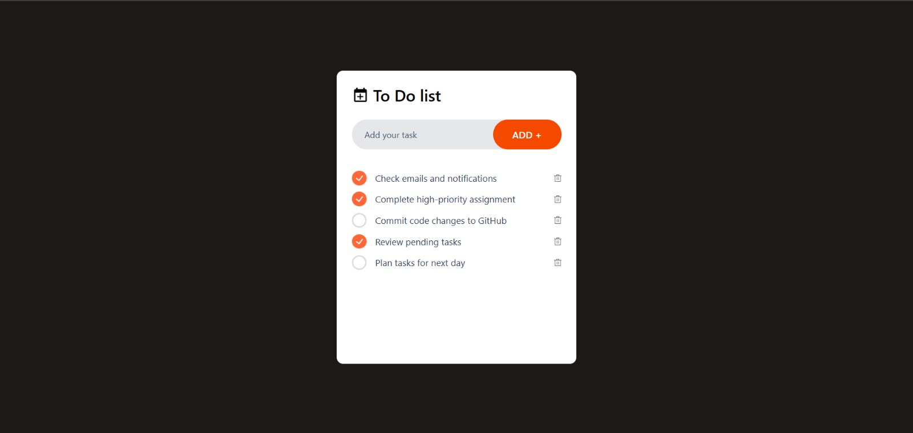
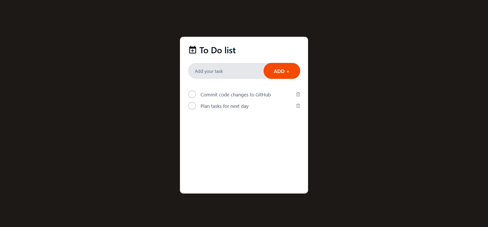

# React Todo App

A simple task management application built using React.  
The app allows users to add, complete, and delete tasks with a clean and minimal interface.

## Features
- Add new tasks
- Mark tasks as completed
- Delete tasks
- Responsive and easy-to-use UI

## Technologies Used
- React
- JavaScript
- CSS

## Description
This project was created to understand React fundamentals such as components, state handling, and event-driven updates.

## Screenshots

### Empty State

### Adding Tasks

### Task Completion Status

### Deleting a Task

